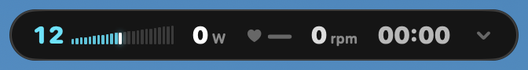

# TrainerHUD

Ride your smart trainer **without Zwift**. A macOS menu-bar app with an always-on-top overlay,
direct Bluetooth to your sensors, and virtual shifting with Zwift Click / Play / Ride on Zwift Cog trainers.




## Features

- Overlay stays visible over full-screen apps. Drag it, minimize it, or make it click-through.
- Power with FTP zones, heart rate with zones, cadence, speed, time, gear, grade.
- Connects to FTMS trainers, power meters, cadence sensors and heart-rate straps automatically.
- Virtual shifting done by the trainer firmware, same feel as Zwift. Works on Zwift Cog trainers
  (Van Rysel, KICKR Core/v6, Zwift Hub, JetBlack, Elite, Tacx NEO). Others get FTMS grade steps.
- Zwift Click v1/v2, Play and Ride as shifters. Every button is mappable.
- ERG mode. `trainerhud://` URL scheme for Alfred, Shortcuts or Stream Deck.

Tested with a Van Rysel D500 V2, Zwift Click v2, COROS HR strap and Assioma pedals.

## Install

```bash
git clone https://github.com/hugoBourretDesmarais/TrainerHUD.git
cd TrainerHUD
./scripts/install.sh
```

Needs macOS 14+ and the Xcode Command Line Tools. Allow Bluetooth when asked.

## Use

1. Quit Zwift. Pedal, press a Click button, put the strap on.
2. Shift with the Clicks, or from the menu-bar icon: ⌘↑ ⌘↓ shift, ⌘= ⌘- grade, ⌘E ERG, ⌘M minimize.
3. Hover the overlay for the minimize button. Drag it by its background.

Settings: FTP, max HR, weights, gear table, overlay fields, button mapping, Click v2 mode.

## Zwift Click v2

Zwift locks the **left** puck (−): it goes quiet a minute after connecting unless you rode in Zwift
in the last ~24 h. The **right** puck (+) is never locked. Settings → Controllers:

- **Unlocked via Zwift** (default): ride in Zwift 30 s a day, both pucks work.
- **Restart loop**: left puck reboots every 50 s.
- **Right puck only**: `+` up, `B` down.

## How it works

The Zwift trainer and controller protocols were reverse-engineered by the community (Makinolo,
ajchellew/zwiftplay, qdomyos-zwift, SHIFTR, BikeControl). This is a fresh MIT implementation.
`swift build && .build/debug/TrainerHUD --selftest` checks it against real captures.
All Zwift-service traffic is logged in hex to `~/Library/Logs/TrainerHUD/TrainerHUD.log`; attach it to issues.

Unofficial. May break with firmware updates. Zwift, Zwift Cog, Click, Play and Ride are trademarks of Zwift Inc.
