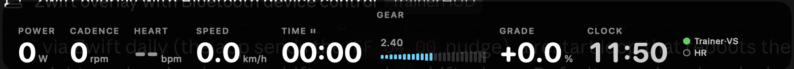

# TrainerHUD

Ride your smart trainer **without Zwift**. A macOS menu-bar app that shows a heads-up overlay
on top of everything, connects straight to your Bluetooth sensors, and does virtual shifting
with Zwift Click / Play / Ride on Zwift Cog trainers.



## What it does

- Overlay visible over full-screen apps (Netflix, games, browser workouts). Drag it, minimize it, or make it click-through.
- Power, cadence, heart rate, speed, time, distance, gear, grade, battery.
- Connects to FTMS trainers, power meters, cadence sensors and heart-rate straps. First device of each kind is picked up automatically.
- Virtual shifting: the trainer simulates the gear itself, exactly like in Zwift. Works on Zwift-Cog trainers (Van Rysel, KICKR Core/v6, Zwift Hub, JetBlack, Elite, Tacx NEO). Others get FTMS grade steps.
- Zwift Click v1/v2, Play, Ride as shifters. Every button is mappable.
- ERG mode, and a `trainerhud://` URL scheme for Alfred, Shortcuts or a Stream Deck.

Tested with a Van Rysel D500 V2, Zwift Click v2, COROS HR strap and Assioma pedals.

## Install

```bash
git clone https://github.com/hugoBourretDesmarais/TrainerHUD.git
cd TrainerHUD
./scripts/install.sh
```

macOS 14+, Xcode Command Line Tools only. Allow Bluetooth when asked.

## Use

1. Quit Zwift. Wake the trainer, press a Click button, put the strap on.
2. Shift with the Clicks, or from the menu-bar icon (⌘↑ ⌘↓ shift, ⌘= ⌘- grade, ⌘E ERG, ⌘M minimize).
3. Hover the overlay for the minimize button; drag it by its background.

Settings (menu bar) has weights, the gear table, overlay fields, button mapping, and the Click v2 mode.

## Zwift Click v2

Zwift locks the **left** puck (−) to its app: it goes quiet a minute after connecting unless you rode in Zwift in the last ~24 h. The **right** puck (+) is never locked. Pick one in Settings → Controllers:

- **Unlocked via Zwift** (default): ride in Zwift 30 s a day, both pucks work.
- **Restart loop**: left puck reboots every 50 s.
- **Right puck only**: `+` up, `B` down.

## How it works

Zwift's trainer and controller protocols were reverse-engineered by the community (Makinolo,
ajchellew/zwiftplay, qdomyos-zwift, SHIFTR, BikeControl). This is a fresh MIT implementation of
those byte formats; `swift build && .build/debug/TrainerHUD --selftest` checks them against real
captures. Every byte exchanged with the Zwift service is logged in hex to
`~/Library/Logs/TrainerHUD/TrainerHUD.log`. Attach that log to issues.

Unofficial. May break with firmware updates. Zwift, Zwift Cog, Click, Play and Ride are trademarks of Zwift Inc.

MIT license.
